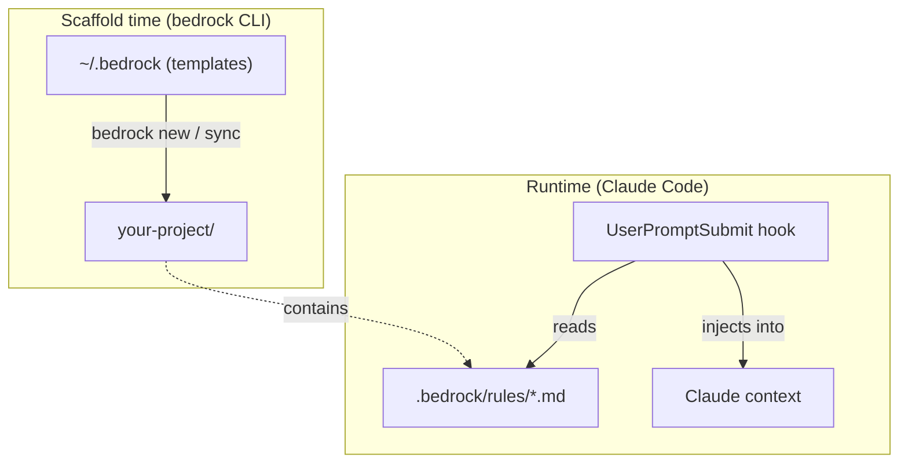
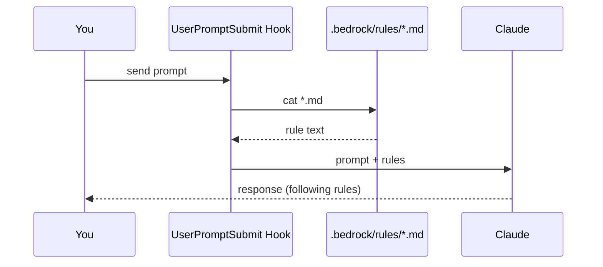

# Architecture

## How it works

bedrock has two phases: **scaffold time** (when you run the CLI) and **runtime** (when you use Claude Code in the project).



## Scaffold time

The CLI copies files from `~/.bedrock` into your project:

| Source | Destination | Ownership |
|---|---|---|
| `.bedrock/rules/*.md` | `.bedrock/rules/*.md` | bedrock (overwritten on sync) |
| `.bedrock/stack.yml` | `.bedrock/stack.yml` | you (created once, never overwritten) |
| `.claude/commands/*.md` | `.claude/commands/*.md` | bedrock (overwritten on sync) |
| `.claude/settings.json` | `.claude/settings.json` | shared (hook merged in, your settings preserved) |
| `CLAUDE.md` | `CLAUDE.md` | you (created once, never overwritten) |
| `PROGRESS.md` | `PROGRESS.md` | you (created once, never overwritten) |

The key distinction: **bedrock owns rules and commands** (they get updated on every sync). **You own CLAUDE.md, PROGRESS.md, and stack.yml** (bedrock never overwrites them after creation).

## Runtime

The magic is a single hook in `.claude/settings.json`:

```json
{
  "hooks": {
    "UserPromptSubmit": [
      {
        "matcher": "",
        "hooks": [
          {
            "type": "command",
            "command": "cat \"$CLAUDE_PROJECT_DIR/.bedrock/rules/\"*.md 2>/dev/null || true"
          }
        ]
      }
    ]
  }
}
```

Every time you send a prompt, this hook reads all rule files and injects them into Claude's context. Claude sees the rules as system instructions -- it doesn't just know about them, it **follows** them.



## File layout in a bedrock project

```
your-project/
  .bedrock/
    rules/           # Engineering rules (injected every turn)
      consent.md
      testing.md
      code-quality.md
      epistemic.md
      iteration.md
    stack.yml        # Your stack config
  .claude/
    commands/        # Slash commands
      qa.md
      stack.md
      progress.md
      remind.md
    settings.json    # Hook config
  CLAUDE.md          # Your project instructions
  PROGRESS.md        # Context recovery doc
```
