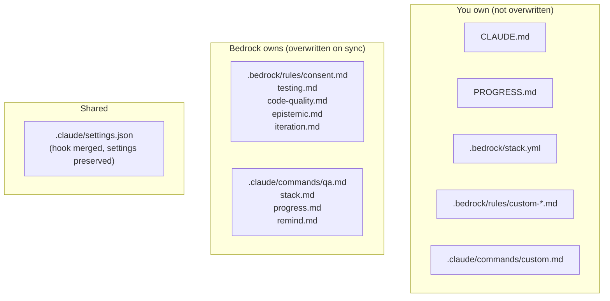

# Extending bedrock

bedrock is designed to be customized. Rules, commands, and stack config are all plain files you can edit or extend.

## Adding custom rules

Create a new `.md` file in `.bedrock/rules/`:

```sh
echo "Always use snake_case for Python functions." > .bedrock/rules/naming.md
```

That's it. The hook reads all `*.md` files in the rules directory, so your custom rule is injected on the next prompt.

!!! tip "Keep rules short"
    Rules are injected on every single prompt. Long rules waste context. One to three sentences is ideal -- state the principle, not the rationale.

## Modifying built-in rules

Built-in rules get overwritten on `bedrock sync`. If you want to modify a built-in rule:

1. **Edit it in place** -- works until you run `bedrock sync` again
2. **Add a companion rule** -- create a new file that refines or overrides the built-in. E.g., `.bedrock/rules/testing-override.md` with `"Integration tests can use mocks for external APIs."`

Option 2 is more durable.

## Adding custom commands

Create a `.md` file in `.claude/commands/`:

```markdown
---
name: deploy
description: Deploy to production
user_invocable: true
---

Run the deployment script and verify the service is healthy.

1. Run `./deploy.sh production`
2. Wait for health check to pass
3. Report the deployed version
```

Now `/deploy` is available in your Claude sessions.

!!! note "Bedrock-owned commands"
    Files copied by `bedrock sync` (`qa.md`, `stack.md`, `progress.md`, `remind.md`) get overwritten on sync. Your custom commands in the same directory are left untouched.

## Customizing stack.yml

`.bedrock/stack.yml` is yours after creation. Add fields as needed:

```yaml
language: python 3.13
type_checker: pyright --pythonversion 3.13
test_runner: pytest
package_manager: uv
pre_commit_hooks: pyright, pytest

# Custom additions
formatter: ruff format
linter: ruff check
```

`/qa` reads `type_checker` and `test_runner` from this file. Other fields are for your own use or custom commands.

## CLAUDE.md

`CLAUDE.md` is your space. bedrock only sets the project name on initial `/stack` run and never touches it again.

Use it for:

- Project-specific instructions ("this is a REST API, use FastAPI patterns")
- User preferences ("I prefer dataclasses over pydantic")
- Corrections ("the database is Postgres 16, not MySQL")

The iteration rule tells Claude to add user corrections here automatically.

## Project structure summary


