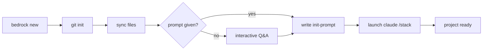

# Getting Started

## Install

```sh
curl -sSf https://raw.githubusercontent.com/jonkhler/bedrock/main/install.sh | sh
```

This clones bedrock to `~/.bedrock` and installs the CLI via `uv tool install`.

## New project

```sh
# Fully automated -- provide stack description upfront
bedrock new ~/dev/my-app "Python 3.13, uv, pyright strict, pytest"

# Interactive -- bedrock asks questions until it has enough info
bedrock new ~/dev/my-app

# Scaffold only, configure later
bedrock new --bare ~/dev/my-app
```

What `bedrock new` does:



After `/stack` runs, your project has:

- Strict type checking configured
- Test runner set up
- Pre-commit hooks installed
- `.bedrock/stack.yml` filled in
- First commits made

## Existing project

```sh
cd your-project
bedrock sync
```

This injects bedrock into a project that already exists. It copies rules, commands, and hooks without touching your code.

If the project already has a `CLAUDE.md` or `PROGRESS.md`, sync warns and skips them. Use `--force` to overwrite:

```sh
bedrock sync --force
```

## Updating

```sh
bedrock update
```

Pulls the latest templates from GitHub and reinstalls the CLI. Then run `bedrock sync` in any project to pick up new rules or commands.

## Verify it works

Open your project with Claude Code:

```sh
cd ~/dev/my-app
claude
```

The rules are injected automatically on every prompt. You can verify with `/remind` -- Claude will list every active rule.
